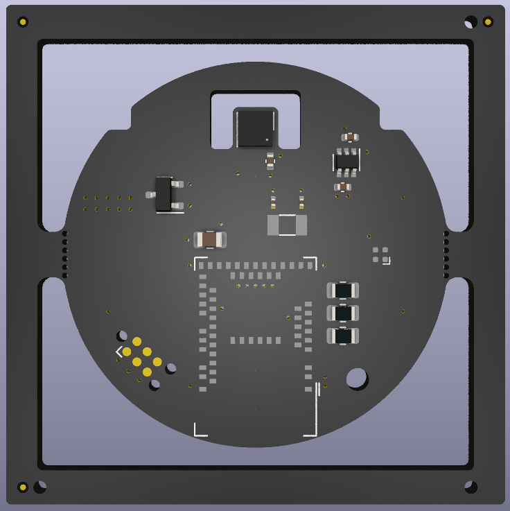

# EnviroPuck 🌍
Introducing the EnviroPuck, a sleek and low-power environment sensing device, utilizing Raytac's MDBT50Q module featuring the nRF52840 chip, and Bosch's BME688 environmental sensor.

  

# Features 🎛️
- Raytac MDBT50Q Module with nRF52840: Enables robust wireless connectivity, supporting Matter/Thread protocols 📡
- BME688 Sensor: Accurately monitors temperature, humidity, pressure, and gas conditions 🌡️💧🌀
- Low Power Design: Powered by a single primary cell CR2032, engineered for energy efficiency and long-lasting performance 🔋

# Applications 🏠
- The EnviroPuck is ideal for home automation, indoor climate monitoring, and various IoT applications requiring environmental data.

# Development Status ⚙️
- Hardware: Prototyped
- Firmware: TODO 
- Mechanical Design: TODO

# License 📄
- This project is released under the CERN Open Hardware License V2 - Permissive. More details can be found in the LICENSE file included in the project.

